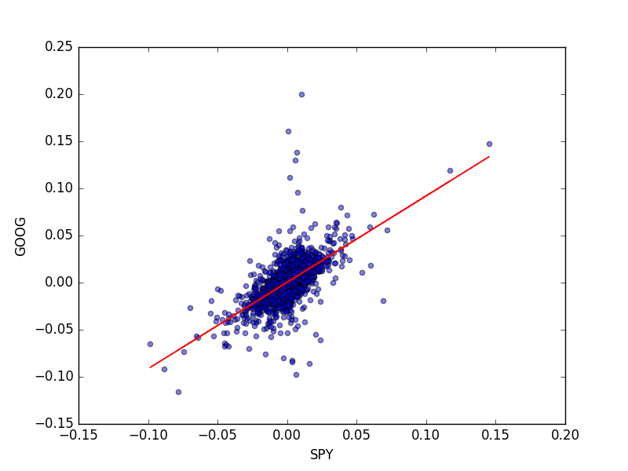

# animating-alpha-and-beta
Making animation of *alpha* and *beta* for given symbols. The codes depend on functions defined in [Machine learning for trading](https://www.udacity.com/course/machine-learning-for-trading--ud501) at Udacity. For the detail, please refer to the class.


# Requirements

## Data
You have to add *Histrical Data* such as [`GOOG.csv`]() to `/data` directry. For example, [YAHOO! FINANCE](https://finance.yahoo.com/) helps you.

1. Access to the summary page of symbol (ex. [google（``GOOG.csv``）](https://finance.yahoo.com/quote/GOOG?p=GOOG)).
2. Click the `Histrical Data` at top of the page.
3. Make sure `Time Period:` is the period you want, and `Frequency:` is `Daily`. Then click `Download Data`.
4. Rename the file if necessary (ex: `table.csv` to `GOOG.c 

## python
* [pandas](http://pandas.pydata.org/) and [NumPy](http://www.numpy.org/) : For manipulating data. I used pandas 0.18.0 and NumPy 1.10.4
* [matplotlib](http://matplotlib.org/) : For making animation. I used matplotlib 0.18.0.

## Udacity

The codes depend on functions defined in [Machine learning for trading](https://www.udacity.com/course/machine-learning-for-trading--ud501) at Udacity. Refer to the class (and take it!). You have to add `udacity.py` which defines `get_data()`, `fill_missing_values()`, and `compute_daily_returns()` to the current directry.

# Model



Hereinafter, we assume `SPY` as the benchmark. The figure shows daily-returns of `SPY` and `GOOG` from Dec. 1, 2006 to Dec. 1, 2016. The regression line can be defined as y = beta x + alpha. 
* alpha: Intercept of the line. It can be considered as the return over the benchmark.
* beta: Slope of the line. It can be considered as the relative volatility.

# How to use 

```py
import animab.py as ab

ab.animate_a_b()

```

# Variables

* `symbols`: List of symbols to animate  
* `start_date` and `end_date`: Defines the animation period. Strings with `yyyy-mm-dd` format.
* `period`: Calculation period of alpha and beta. 

# License
MIT
